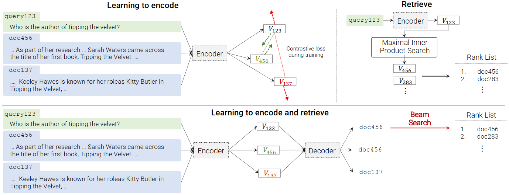
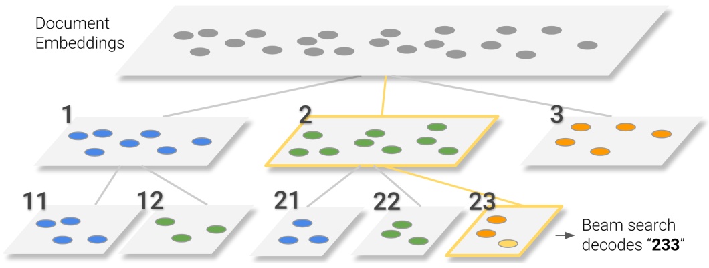
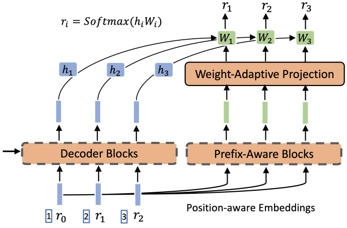
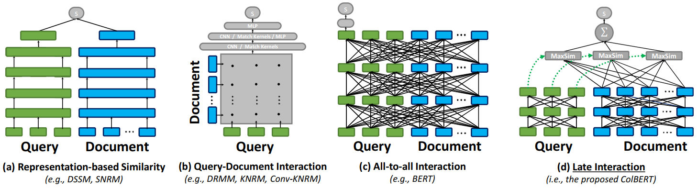
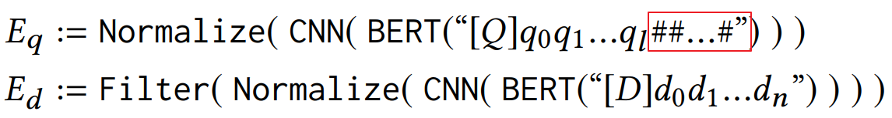
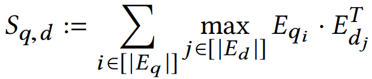
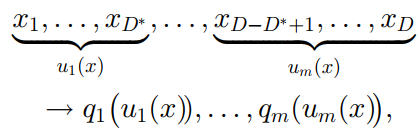
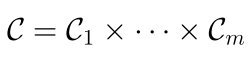
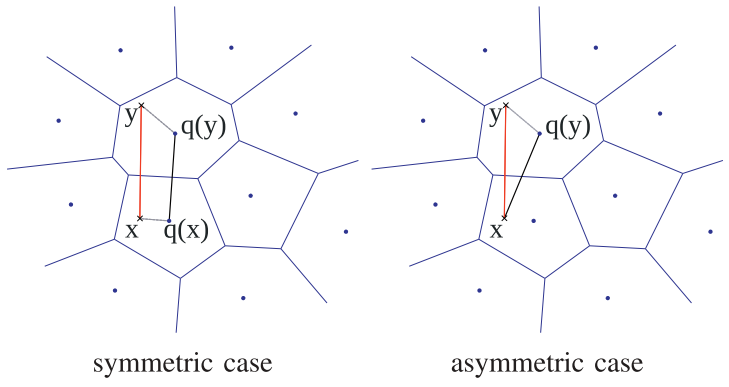
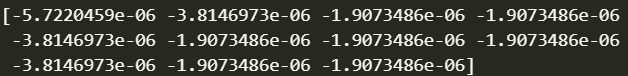

<div class="cover" style="page-break-after:always;font-family:方正公文仿宋;width:100%;height:100%;border:none;margin: 0 auto;text-align:center;">
    <div style="width:60%;margin: 0 auto;height:0;padding-bottom:10%;">
        </br>
        
    </div>
    </br></br></br></br></br>
    <div style="width:60%;margin: 0 auto;height:0;padding-bottom:40%;">
        
	</div>
    </br></br></br></br></br></br></br></br>
    <span style="font-family:华文黑体Bold;text-align:center;font-size:20pt;margin: 10pt auto;line-height:30pt;"> 数据库系统实现期末作业 </span>
    <p style="text-align:center;font-size:14pt;margin: 0 auto"> 向量数据库原理与实现 </p>
    </br>
    </br>
    <table style="border:none;text-align:center;width:72%;font-family:仿宋;font-size:14px; margin: 0 auto;">
    <tbody style="font-family:方正公文仿宋;font-size:12pt;">
    	<tr style="font-weight:normal;"> 
    		<td style="width:20%;text-align:right;">题　　目</td>
    		<td style="width:2%">：</td> 
    		<td style="width:40%;font-weight:normal;border-bottom: 1px solid;text-align:center;font-family:华文仿宋"> 向量数据库原理与实现 </td>     </tr>
    	<tr style="font-weight:normal;"> 
    		<td style="width:20%;text-align:right;">课程名称</td>
    		<td style="width:2%">：</td> 
    		<td style="width:40%;font-weight:normal;border-bottom: 1px solid;text-align:center;font-family:华文仿宋"> 数据库系统实现期末作业 </td>     </tr>
    	<tr style="font-weight:normal;"> 
    		<td style="width:20%;text-align:right;">授课教师</td>
    		<td style="width:2%">：</td> 
    		<td style="width:40%;font-weight:normal;border-bottom: 1px solid;text-align:center;font-family:华文仿宋"> 胡卉芪 </td>     </tr>
    	<tr style="font-weight:normal;"> 
    		<td style="width:20%;text-align:right;">姓　　名</td>
    		<td style="width:2%">：</td> 
    		<td style="width:40%;font-weight:normal;border-bottom: 1px solid;text-align:center;font-family:华文仿宋"> 鄢明远 </td>     </tr>
    	<tr style="font-weight:normal;"> 
    		<td style="width:20%;text-align:right;">学　　号</td>
    		<td style="width:2%">：</td> 
    		<td style="width:40%;font-weight:normal;border-bottom: 1px solid;text-align:center;font-family:华文仿宋"> 10190350440 </td>     </tr>
    	<tr style="font-weight:normal;"> 
    		<td style="width:20%;text-align:right;">日　　期</td>
    		<td style="width:2%">：</td> 
    		<td style="width:40%;font-weight:normal;border-bottom: 1px solid;text-align:center;font-family:华文仿宋"> 2023.06.29 </td>     </tr>
    </tbody>              
    </table>
</div>

<!-- 注释语句：导出PDF时会在这里分页 -->

# 向量数据库原理与实现

[toc]


##  引言

随着计算能力的提升和人工智能算法的快速发展，深度学习模型已经取代了传统的线性回归和词袋模型等简单方法。机器自动学习特征的能力逐渐取代了过去依赖人工特征工程的方式。同时，随着数据量的增大，大型模型也展现出更强大的表达能力。为了处理不同的数据模态，越来越多的数据被转换为嵌入或向量表示。通用模型架构，如Transformer，使得可以将所有模态的信息表示为向量。因此，在处理这些新场景中的数据时，可以概括出以下两个典型的步骤：

1. 结构化和非结构化数据的向量化：这一步骤将原始数据（可能是非结构化的）转换为向量表示。原始数据可能来自不同的模态，例如语言或图像，因此具有不同的特性。这些向量表示可以在离线操作时进行嵌入编码，并进行静态缓存。
2. 向量的应用和融合：这一步骤涉及将向量转换为结果、决策或反馈，并进行后续操作。可以通过在线融合模块实现向量的检索和处理，该模块是集中式且动态的。在这个阶段，可以有效地融合不同模态的信息，以支持各种应用领域的需求。

在第一个步骤中，我们关注的是嵌入编码。嵌入编码是将原始数据转换为向量表示的过程，可以在离线操作时进行，并进行静态缓存。原始数据可能来自不同的模态，并具有不同的特性。例如，语言单位的标记（token）通常是离散且离散化的，而图像单位则是连续且冗余的。因此，语言模型BERT的掩码率通常为15%，而图像模型MAE的掩码率则达到75%。这表明图像模型比语言模型更冗余，需要更多的掩码操作。这提示我们不同模态之间存在潜在的压缩空间，因此在保留原有信息的同时，向量嵌入的维度可以更低，实现更高的压缩率。

在第二个步骤中，可以通过建立索引来加快向量的检索。一种常见的索引方法是在传统领域中常用的向量数据库，例如信息检索和推荐系统中常见的索引方法，用于最近邻操作。另一种方法是近年来出现的神经索引，依赖于神经网络强大的记忆能力。


## 背景知识

### 神经索引和向量索引

向量数据库中索引的选择是一个重要的问题。常见的索引方法包括神经索引（neural index）和离线索引（offline index）。神经索引方法将索引构建过程融入到训练阶段，利用神经网络建立文档与其标识（docid）之间的映射关系。




#### 神经索引

神经索引方法代表模型有DSI（Differentiable Similarity Indexing）和NCI（Neural Collaborative Indexing）。这些方法与传统的离线索引方法不同，它们不显式地构建索引阶段，而是将构建索引的过程融入到训练过程中，通过端到端的神经网络实现。在索引阶段/训练阶段，利用神经网络建立文档与文档标识符（docid）之间的映射关系。在检索阶段/测试阶段，输入查询并生成候选的docids。

其中，DCI是神经索引方法的一个示例。它包括以下步骤：

1. 文档表示：从文档中提取前$L$个标记作为表示。

2. 文档标识符：使用层次k-means算法构建文档标识符。这个过程将文档嵌入空间划分为多个簇，并为每个簇分配一个标识符。

   

3. 多任务学习：使用T5预训练模型的seq2seq方法进行文档索引和查询检索。通过多任务学习，模型能够同时学习文档的表示和文档标识符之间的映射关系。

NCI是对DCI的一些改进。它引入了以下改进：

1. 查询生成：使用预训练的DocT5Query模型和分块的样本文档进行查询生成。这样可以生成与文档相关的查询，提高检索的准确性。

2. 前缀感知的权重自适应解码器：通过连接位置和标记值，并使用前缀感知的权重进行解码。这个改进可以提高解码的效果，使得模型能够更好地理解查询和文档之间的关联。

   

这些神经索引方法的优点是可以通过端到端的训练获得较好的性能，并且能够提供准确的检索结果。然而，它们的缺点是每次增删数据时都需要重新训练神经网络，维护代价较高。


#### 离线索引

离线索引是在向量数据库中进行最近邻搜索的常见方法。它的架构通常由查询编码器、文档编码器和交互模块组成。离线索引方法的设计目标是尽可能将计算集中在编码器端，而非交互端。通过提前对文档进行离线编码和索引构建，可以避免对长文档编码的高计算成本，从而加快后续的查询操作。




ColBERT（Contextualized Late Interaction over BERT）是一个代表性的离线索引模型，它采用了孪生塔架构和交互模块，旨在提高查询效率并减少对长文档编码的计算开销。

ColBERT模型的架构如下所示：

1. 编码器：

   

   - 查询增强：为了使查询长度达到固定的长度$N_q$，ColBERT在查询中填充了特殊的[mask]标记。
   - 文档：ColBERT对文档进行编码时，过滤掉与标点符号对应的嵌入，以减少干扰。

2. 晚期交互：

   

   - ColBERT通过晚期交互模块实现查询与文档之间的交互。该模块能够在编码的基础上进一步优化查询和文档之间的匹配程度。

3. 对比学习损失函数：

   - ColBERT使用对比学习中的成对softmax交叉熵损失函数进行训练。该损失函数能够鼓励正样本（相关查询-文档对）的相似性得分高于负样本（不相关查询-文档对）的相似性得分。

通过采用孪生塔架构和交互模块，ColBERT模型能够在离线索引中有效地进行查询和文档之间的交互，并减少对长文档编码的计算开销，从而提高了查询效率。这种架构设计使得ColBERT成为一个优秀的离线索引模型，并在许多信息检索任务中取得了显著的性能提升。

离线索引方法是最常见的向量数据库中的最近邻搜索方法。其架构通常包括查询编码器、文档编码器和交互模块。离线索引方法尽可能将计算集中在编码器端，而非交互端。通过提前对文档进行离线编码和索引构建，避免对长文档编码的高开销，从而加快后续查询操作。代表模型如ColBERT（Contextualized Late Interaction over BERT）采用孪生塔架构和交互模块，能够提高查询效率并减少对长文档编码的计算开销。


### 向量模型

在传统的向量模型中，将所有向量视为同质的方法存在一些问题。例如，在词嵌入中，一个单词的上下文中并不一定包含该单词本身，甚至可能呈现负相关关系。因此，在文档检索问题中，查询向量与文档向量之间的内积并不一定很高，可能需要通过复杂的映射或相似度计算来确定它们的关联性。为了解决这个问题，引入了向量异质化的概念，将向量分为查询（query）向量和键（key）向量，以放松所有向量同质的假设。

在这个抽象模型中，键和值可以是异质的，其中键对应于中心词，值对应于周围词，并分别具有不同的权重。这种异质化的处理可以根据先验知识来确定。为了使键向量同质化，可以使用MOCO（Momentum Contrastive Learning）模型，并采用动量更新的方法，以保证队列中的键尽可能同质。


### 精确近邻和近似近邻

在向量数据库的检索方法中，可以将其分为精确近邻和近似近邻两类。精确近邻方法能够得到完全正确的结果，但在大规模数据集上计算复杂度较高。常见的精确近邻方法包括暴力枚举和基于树的方法，如kd-tree算法。而近似近邻方法则通过召回和排序两个步骤进行高效的近似匹配。召回阶段通过粗粒度的过滤操作得到候选数据集，排序阶段则对候选数据集进行细粒度的排序操作。近似近邻方法需要在正确性、效率和内存消耗之间进行权衡。常见的近似近邻方法包括局部敏感哈希（local sensitive hashing）、向量量化（vector quantization）、乘积量化（product quantization）和层级可导航小世界网络（Hierarchical Navigable Small World）等。

在具体的检索方法中：

- 精确近邻方法能够得到完全正确的结果，但计算复杂度较高。其中，暴力枚举方法需要对查询和数据库中的每个向量进行逐一比较，时间复杂度为$O(|Q| \times |K|)$，其中$|Q|$是查询向量的数量，$|K|$是数据库中向量的数量。倒排索引方法常用于搜索引擎数据库，但只支持精确匹配，不适合近似匹配。基于树的方法，如kd-tree算法，通常需要回溯，其计算复杂度仍然是$O(|Q| \times |K|)$。
- 近似近邻方法通过在正确性、效率和内存消耗之间进行权衡，实现高效的近似匹配。它通常包括两个阶段：召回和排序。召回阶段通过粗粒度的过滤操作，以较低的代价得到候选数据集。排序阶段则对候选数据集进行细粒度的排序操作。不同的近似近邻方法有不同的实现方式和特点。
  - 局部敏感哈希（local sensitive hashing）方法假设将文档抽象成词袋模型，并利用Jaccard相似度进行计算。然而，由于向量模型和词袋模型并不一致，并且查询向量和文档向量是异质的，局部敏感哈希方法存在一些缺陷，例如内存消耗较大等问题。
  - 向量量化（vector quantization）方法常用k-means或层次聚类算法对向量进行量化。通过将向量映射到离散的码本中，可以减少计算复杂度。然而，向量量化方法需要在维护码本的有效性和计算准确性之间进行权衡。
  - 乘积量化（product quantization）方法采用了一种分块的方式将向量分解成多个子向量，并使用乘积量化器对子向量进行量化。通过修改倒排文件结构，可以提高查询效率和减少内存消耗。

这些近似近邻方法在不同的应用场景中具有各自的优势和适用性，可以根据具体的需求选择合适的方法。


## 模型

### 量化

量化是一种常用的方法，用于减少数据表示的复杂度。它通过将实值数据映射到一组离散的值来实现。在量化过程中，将数据分配给一组聚类中心，然后用这些聚类中心来表示原始数据。这种表示方法可以大大减少存储和计算的需求，同时在一定程度上保持数据的准确性。

在量化中，有两种常见的方法：向量量化（Vector Quantization）和乘积量化（Product Quantization）。这两种方法都旨在通过将数据映射到一组离散的聚类中心来减少数据的表示复杂度。然而，它们在实施方式和优势方面有所不同。

本次实验中我实现了两种编码方法，通过参数控制。

```python
def indexing(self, method: str, codebook_size: int, num_subvectors: int = 1):
    Utils.set_seed()

    if method == 'vectored':
        self.vector_quantization(codebook_size)
    elif method == 'producted':
        self.product_quantization(codebook_size, num_subvectors)
    else:
        raise NotImplementedError("Invalid quantized_type.")
```


#### 向量量化

向量量化是将数据划分为多个子向量，并对每个子向量进行独立的量化。每个子向量都有自己的聚类中心和编码方式。

通过迭代地将训练集中的向量分配给聚类中心，并根据分配的点重新估计这些聚类中心，可以找到一个近乎最优的码本(codebook)。在这里使用 k-means 来学习量化器(quantizer)。需要注意的是，k-means 只能在量化误差方面找到局部最优解。

这种方法可以在保持较高精度的同时，减少存储空间和计算复杂度。然而，向量量化需要处理大量的聚类中心，因此在大规模数据集上可能会面临存储和计算的挑战。


#### 乘积量化

乘积量化是一种更高效的方法，它将数据分割为多个子向量，并对每个子向量进行独立的量化。不同的是，乘积量化允许子向量之间进行联合量化，即将它们的量化结果组合起来表示整个向量。这种联合量化可以大大减少所需的存储空间和计算复杂度。乘积量化通过将多个子向量的量化结果组合起来，同时保持较高的准确性。这种方法特别适用于处理大规模数据集和高维特征。

乘积量化（Product Quantization）是解决这些问题的有效方法。它是源编码中常用的技术，允许联合选择要量化的分量数量。输入向量 x 被分割为 m 个不同的子向量 uj，其中 1 ≤ j ≤ m，每个子向量的维度为 D' = D/m，其中 D 是 m 的倍数。每个子向量分别使用一个独立的量化器进行量化。因此，给定向量 x 的映射如下：



乘积量化器的重构值由乘积索引集合 I 识别。因此，码本的定义是一个笛卡尔积形式：



通过将子向量的量化过程联合起来，乘积量化能够有效地减少所需的存储空间和计算复杂度，同时仍能保持较高的量化精度。乘积量化在大规模向量数据库检索和高维特征表示中具有广泛应用。

然而，需要注意的是，乘积量化可能需要计算密集型硬件支持才能发挥其优势。在普通计算机上，乘积量化的效果可能并不显著，速度和效果都不尽如人意。因此，在应用乘积量化时，需要考虑到硬件资源的配备和性能要求，以确保能够获得最佳的效果。


### 对称编码与缓存

### 对称距离计算和非对称距离计算

在量化中，有两种常见的距离计算方法：对称距离计算（Symmetric Distance Computation）和非对称距离计算（Asymmetric Distance Computation）。这些方法用于衡量向量之间的相似度或差异度量。



在我的实现中，我同时实现了这两种方法，并给出了它们的大致框架。

```python
def search_vector_quantization(self, queries, top_k, symmetric):
    top_k_candidates = []  # List to store the top-k candidates for each query
    codebook_indices = self.kmeans.predict(queries)

    if symmetric:
        # Less accurate but faster with cache

        # Cached results for each cluster
        # Retrieve the cached top-k candidates for each query
        ...

    else:
        # More accurate but slower

        # Calculate the top-k candidates for each query
        ...
```


#### 对称距离计算

对称距离计算是指同时对值向量和查询向量进行量化，并计算它们之间的距离。这种方法通常用于将值向量和查询向量都映射到一组离散的聚类中心，以便进行有效的相似度比较。对称距离计算的好处是它便于缓存，可以提高运算效率。

然而，对称距离计算也存在一些缺点。由于值向量和查询向量都经过量化，它们的精确度可能会有所降低，从而导致较大的误差。这种精确度损失可能会对一些应用造成影响，特别是对于要求高精度的任务而言。


#### 非对称距离计算

与对称距离计算相对应，非对称距离计算只对值向量进行量化，而查询向量则可能保持原始表示不进行量化。这种方法的主要目的是减少查询过程中的计算开销，并提高查询的效率。

非对称距离计算可以通过将查询向量与量化的值向量进行比较来衡量它们之间的差异或相似度。由于只有值向量进行了量化，非对称距离计算通常能够保持较高的精确度，从而减少了误差。

然而，非对称距离计算也存在一些限制。由于查询向量未经量化，它们的表示可能更加复杂，导致计算开销较大。此外，在一些应用中，需要权衡计算效率和精确度之间的折衷，以确定是否使用非对称距离计算。

值得注意的是，并非说非对称距离计算完全没有优化空间。在乘积量化（Product Quantization）中仍然可以利用缓存进行一些优化。以下是一个示例代码，详细代码请参考原始代码。

```python
def search_product_quantization(self, queries, top_k=5, symmetric=False, cached=True):
    sub_queries = queries.reshape(-1, self.embd_dim // self.num_subvectors)
    coarse_distances_partitions = []

    if symmetric:
        # Less accurate but faster with cache

        # Cache paired distances between codebook entries
        # Quantize sub-queries using the codebook
            # Retrieve coarse distances using the cached paired distances
        ...

    else:
        # More accurate but slower
        if cached:
            # Cache distances for every query
            # Split cached coarse distances into partitions
                # Retrieve coarse distances for each sub-query using the cached distances
            ...
        else:
            # Without cache
                # Calculate coarse distances between sub-queries and sub-codebooks
            ...
    # Aggregate coarse distances from different partitions
    # Find top-k candidates based on coarse distances
    ...
```


### 其他实施细节

在实施和优化量化算法时，以下细节非常重要，可以确保算法的高效性和正确性。


**vector：倒排索引**

```python
# Create inverted indexes
self.inverted_indexes = {
    inverted_index: np.where(indexes == inverted_index)[0] 
    for inverted_index in range(codebook_size)
}
```

在实现中，我使用了一种称为非聚簇索引的倒排索引方法，类似于MySQL中的非主键索引。对于每个聚类中心（inverted_index），创建了一个倒排索引（inverted index），其中存储了与该聚类中心对应的数据点的索引。这样的索引方式占用较小的存储空间，但需要在查询过程中进行额外的回表操作。


**product：向量化编码**

- 对所有点进行聚类，而不仅仅是对特定的子向量。
- 这是因为不同点之间是同质的，特别是对于应用了LayerNorm的语言模型而言。通过对所有点进行聚类。


**数据惰性加载**

```python
@property
def data(self):
    """
    Get the structured data from the lazy data.
    """
    if not self.is_structured:
        # Concatenate the data in the list and convert it to a numpy array
        self.structed_data = np.concatenate(self.lazy_data, axis=0)
        assert self.structed_data.shape[1] == self.embd_dim

        self.lazy_data = list(self.structed_data)
        self.is_structured = True
    
    return self.structed_data
```

这部分内容相对复杂，请阅读原始代码以获取更详细的解释。

这段代码将一个方法包装成了一个属性方法。它用于访问被称为`lazy_data`的未结构化数据。如果数据尚未被结构化，则通过将数据列表进行连接并转换为NumPy数组来进行结构化。这样做的好处是，在后续访问中，可以通过访问`data`属性方法来获取结构化的数据，而无需每次都重新计算。


**top_k算法**

在这个实现中，采用了一种名为`np.argpartition`的算法，而不是常用的`argsort`算法。`np.argpartition`算法可以在给定的维度上将数据划分为两个分区，其中一部分包含最小的元素，另一部分包含最大的元素。与`argsort`不同，`np.argpartition`只保证分区内的元素是部分有序的，而不保证整体有序。这样的特性使得在获取前k个候选结果时更加高效。


**距离的两种实现方法**

这里介绍了两种不同的距离计算方法，它们分别使用了不同的技术来实现。

实现方法1：

```python
def l2_distance(queries, keys):
    # Broadcasting: (num_queries, 1, embd_dim) - (1, num_keys, embd_dim)
    squares = queries[:, np.newaxis] - keys
    # Got a (num_queries, num_keys, embd_dim) array.
    distances = np.linalg.norm(squares, axis=2)

    return distances
```

这个方法利用了广播机制（broadcasting）来计算欧氏距离。通过广播机制，我们可以将形状不同的两个数组进行运算，其中`(num_queries, 1, embd_dim)`表示查询向量，`(1, num_keys, embd_dim)`表示键向量。

实现方法2：

```python
def l2_distance(queries, keys):
    queries_norm = np.sum(queries**2, axis=1).reshape(-1, 1)
    keys_norm = np.sum(keys**2, axis=1)
    squares = queries_norm + keys_norm - 2 * np.dot(queries, keys.T)
    distances = np.sqrt(squares)

    return distances
```

这个方法利用了内积的性质来计算欧氏距离。首先，计算查询向量和键向量的范数平方，分别保存在`queries_norm`和`keys_norm`中。然后，通过矩阵乘法`np.dot(queries, keys.T)`计算查询向量和键向量的内积。接下来，利用欧氏距离的定义，通过加法和减法得到一个差向量的平方矩阵`squares`，最后对每个元素取平方根，得到距离矩阵。

注意其中的`queries_norm`和`keys_norm`可以提前缓存计算。用空间换时间。


需要注意的是，这两种方法都是计算欧氏距离，只是使用了不同的实现方式。具体使用哪种方法取决于具体的应用场景和性能需求。

我之所以使用了两种方法，是因为最初我使用第一种实现方法时出现了数值计算的错误。我发现在某些情况下，由于舍入精度问题，平方可能导致负数，这是不正确的。

```python
def l2_distance(queries, keys):
	
    squares = ...
    
    # print verbose information
    if (squares < 0).any():
        print(squares[np.where(squares < 0)])
    
    distances = np.sqrt(squares)

    return distancess
```



我解决了这个问题，通过使用`np.clip`函数将负数的平方截断为零。

```python
squares = np.clip(squares, a_min=0, a_max=None)
```

通过以上修正，我成功地解决了数值计算错误的问题，确保了算法的正确性。

```python

```

## 实验结果

实验部分的代码主要包括两个函数：`run_experiment`和`random_search`。

`run_experiment`函数用于运行单个实验。

```python
def run_experiment(embd_dim, num_queries, num_docs, codebook_size, num_subvectors, queries_topk, keys_topk):
    queries, docs = Utils.generate_data(embd_dim, num_queries, num_docs)

    db = VectorEngine(embd_dim)
    db.add(docs)
    db.indexing(method='vectored', codebook_size=codebook_size)

    results = []
    ...
```

它首先生成查询向量和文档向量，然后构建向量引擎，并进行向量索引。在构建索引后，它使用不同的算法和参数进行搜索，并计算搜索时间和召回率。最后，它将实验结果存储到列表中，并将列表转换为`DataFrame`并返回。


`random_search`函数用于运行多个实验。

```python
for _ in range(num_experiments):
    # hyper-paramter configuration
    ...
    # Run experiment and append results to DataFrame
    experiment_df = run_experiment(embd_dim, num_queries, num_docs, codebook_size, num_subvectors, queries_topk, keys_topk)
    results_df = pd.concat([results_df, experiment_df], ignore_index=True)
```


它循环指定的实验次数，并在每次循环中设置实验的常量参数和随机选择超参数。然后，它调用`run_experiment`函数执行单个实验，并将实验结果与之前的结果合并到一个`DataFrame`中。最后，它返回包含所有实验结果的`DataFrame`。

<table>
    <tr>
        <th>Algorithm</th>
        <th>Symmetric</th>
        <th>Cached</th>
        <th>Search Time</th>
        <th>Recall</th>
    </tr>
    <tr>
        <td>VQ</td>
        <td>Symmetric</td>
        <td>Cached</td>
        <td>0.0198</td>
        <td>0.0892</td>
    </tr>
    <tr>
        <td>VQ</td>
        <td>Asymmetric</td>
        <td>Not Cached</td>
        <td>0.0470</td>
        <td>0.8409</td>
    </tr>
    <tr>
        <td>brute</td>
        <td>Asymmetric</td>
        <td>Not Cached</td>
        <td>0.1845</td>
        <td>1.000</td>
    </tr>
    <tr>
        <td>PQ</td>
        <td>Asymmetric</td>
        <td>Cached</td>
        <td>0.2664</td>
        <td>0.1043</td>
    </tr>
    <tr>
        <td>PQ</td>
        <td>Symmetric</td>
        <td>Cached</td>
        <td>0.3072</td>
        <td>0.05836</td>
    </tr>
    <tr>
        <td>PQ</td>
        <td>Asymmetric</td>
        <td>Not Cached</td>
        <td>0.5199</td>
        <td>0.1043</td>
    </tr>
</table>


根据实验结果可以得出以下观察和猜想：

1. VQ算法在对称索引和缓存的情况下（Symmetric/Cached）具有最低的搜索时间（Search Time），而且检索的召回率（Recall）也相对较高。这可能是因为VQ算法可以有效地利用向量引擎和索引结构进行高效搜索。
2. brute算法在非对称索引且未缓存的情况下（Asymmetric/Not Cached）具有较高的搜索时间，但它能够完全检索到所有相关文档（Recall = 1.0）。这是因为brute算法直接计算查询向量和文档向量之间的距离，没有使用索引结构，因此搜索时间较长。
3. PQ算法在对称索引和缓存的情况下（Symmetric/Cached）具有较高的搜索时间，并且召回率较低。这与预期的相反，因为PQ算法通常被设计为高效的近似搜索算法。可能的解释是在这个特定的实验设置中，PQ算法没有充分利用到并行计算的优势，导致搜索时间较长。

综上所述，根据实验结果和观察，VQ算法在对称索引和缓存的情况下表现最佳，而PQ算法在这个特定的实验设置中的性能较差。对于为什么PQ算法反而比VQ算法慢，可能是因为在该实验中PQ算法未能充分利用并行计算的优势。要更准确地确定原因，可能需要进一步调查和分析实验的具体设置、数据量、超参数等因素。


## 结语

通过这个向量数据库的实验研究，我深入探索了向量索引和搜索算法的原理与应用。在这个过程中，我查阅了大量的文献，进行了反复实验，并且努力学习和理解了不同算法的优劣之处。我通过调整参数和进行改进，力求获得更好的性能和结果。

我投入了大量的时间和精力来思考这个项目，思考了各种构想和方案。我从数据集的生成开始，一直到索引的构建，尝试了多种不同的方法，并不断进行优化和调整。为了更好地了解最新的技术和方法，我还花费了很多时间阅读和分析相关领域的研究论文。然而，尽管我付出了很多努力，但由于时间有限，我没有能够完成所有的工作，例如对数据集生成方式对聚类效果的影响等方面的研究。

综上所述，本文的目的是介绍向量数据库的基本原理和实验研究。我详细讲解了向量索引和搜索算法，并通过实验比较了不同算法的性能。我希望通过这些内容，可以对向量数据库有一个基础的了解，并为进一步的研究和探索提供一些思路和参考。

最后，我除了提供了源码外，还附上了运行结果，欢迎使用代码进行更多的实验。我相信通过进一步的实验和研究，我们可以不断优化和改进向量数据库的性能，为大规模数据检索提供更高效和准确的解决方案。在这个过程中，我学到了很多，并付出了很多努力。尽管没有完成所有的工作，但我对自己所取得的成果感到满意。
